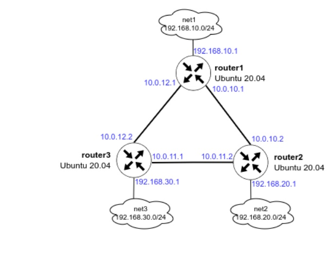
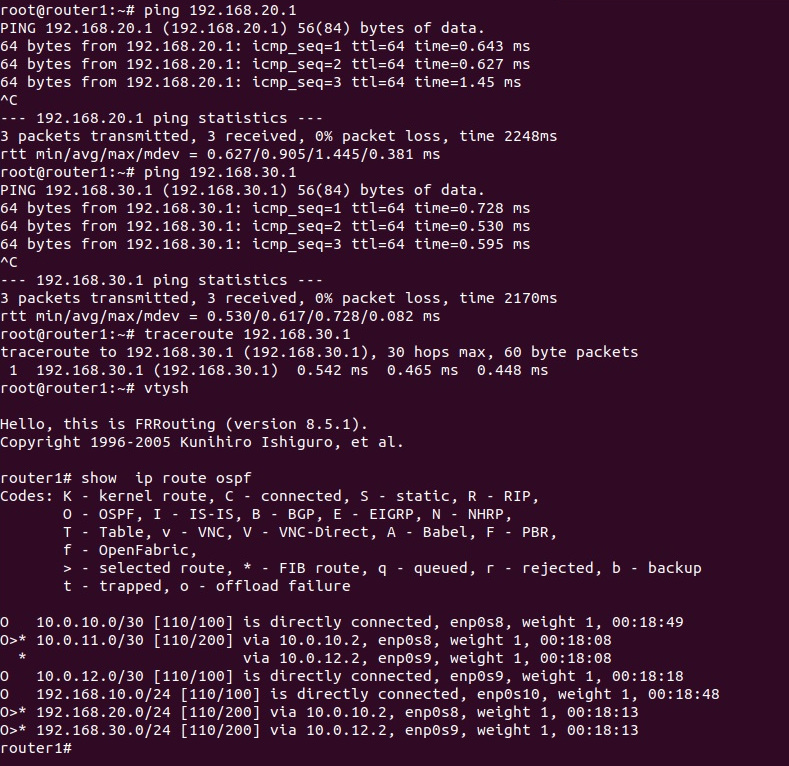
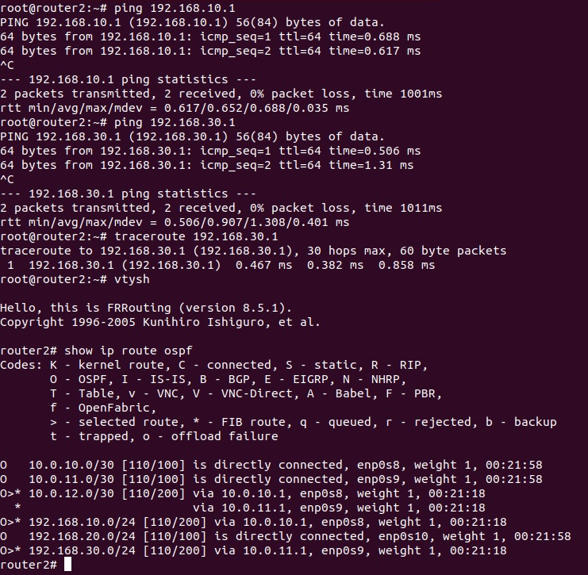
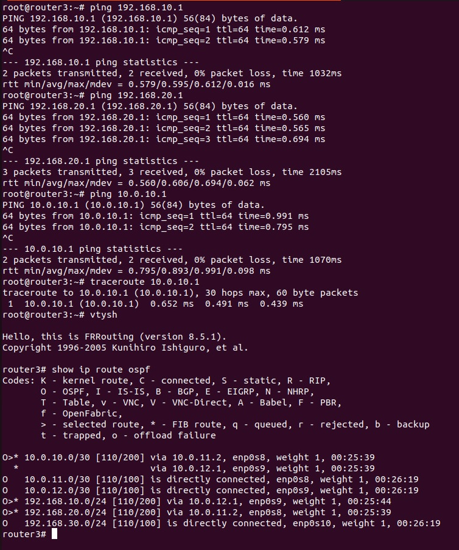
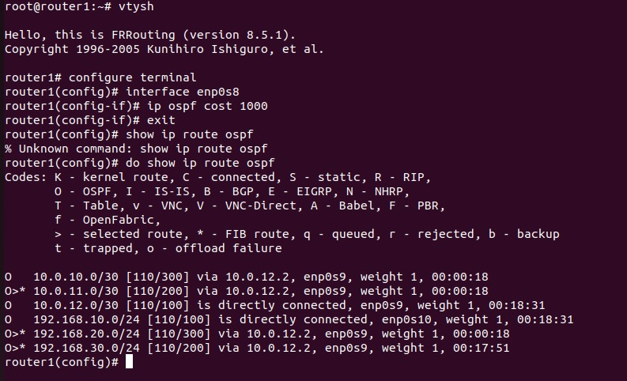
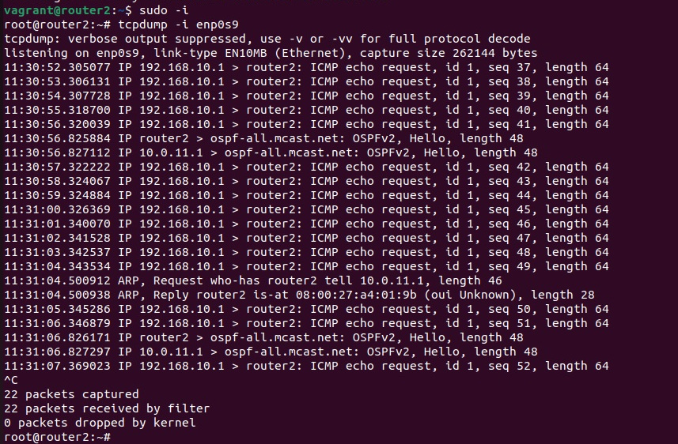
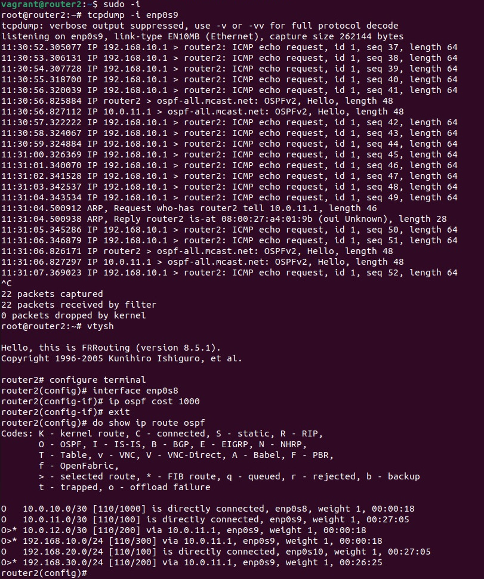
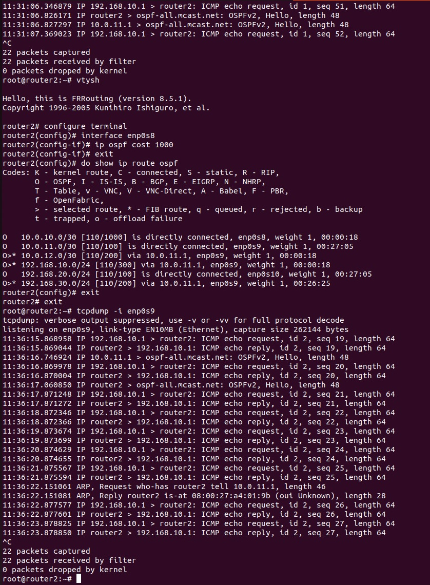

# Статическая и динамическая маршрутизация, OSPF

Задание:

1. Развернуть 3 виртуальные машины
2. Объединить их разными vlan
- настроить OSPF между машинами на базе Quagga;
- изобразить ассиметричный роутинг;
- сделать один из линков "дорогим", но что бы при этом роутинг был симметричным.

Выполнение:

**Схема сети**



Разворачиваем роутеры через Vagrant и Ansible и проверяем доступность сетей с разных хостов.







## Настройка и проверка ассиметричного роутинга


```
root@router1:~# vtysh

Hello, this is FRRouting (version 8.1).
Copyright 1996-2005 Kunihiro Ishiguro, et al.

router1# conf t
router1(config)# int enp0s8 
router1(config-if)# ip ospf cost 1000
router1(config-if)# exit
router1(config)# exit
```





## Настройка и проверка симетричного роутинга с дорогими интерфейсами

```
router2# conf t
router2(config)# int enp0s8
router2(config-if)# ip ospf cost 1000
router2(config-if)# exit
router2(config)# exit
```




